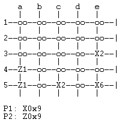

# Logic Programming

This repository contains both projects for the Logic Programming course @ FEUP. The first project is meant for us to get familiar with the ```prolog``` programming language and the main objective is to develop a board game. The second project is meant for us to understand how to solve constraint problems.

## Nava

For our first project we developed a replication of the board game __Nava__. You can consult its rules [here](https://drive.google.com/file/d/1qfZp_uDWRPxPU5U2lN-EGNDfEHkjha1u/view).



## Tricky Triple

For the second project we have developed a program that could solve [Tricky Triple](https://erich-friedman.github.io/puzzle/shape/) puzzles.
