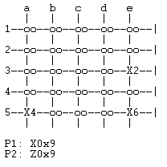

# PLOG 2020/2021 TP1

## Group T1_Nava5
| Name | Number | E-mail |
| ----- | ----- | ----- |
| Antonio Pedro Reis Ribeiro Sousa Dantas | 201703878 | up201703878@fe.up.pt |
| João Miguel Aguiar Cunha | 201403343 | up201403343@fe.up.pt |

---

## Nava
Nava is a 2, 3 or 4 players abstract strategy game. We'll be covering the 2-player version, which is played on a 5x5 grid. At the start of a game each player gets 6 discs and 9 cubes. The 6 discs of each player are positioned on the opposite corners of the board as a stack. The players take turns moving their disc stacks, or part of their disc stacks along the junctions of the board grid in a straight line, not being able to turn corners on the same turn. A stack can move as far as the ammount of discs on it and can be composed of both players discs, being that the owner of the stack is the top piece. As such, a player can split a stack to move the ammount of junctions he wants, noting that the number of junctions moved and the size of the stack being moved must always match. A player can capture enemy stacks, making them their own to control, by moving one of his own stacks to the same junction. When a player moves the entirety of a stack out of a junction he leaves on that same junction one of his cubes. A cube can be removed by making a stack land on the junction the cube is at, being your own or the other player cube.
To win the game a player can either take control of all stacks present at the board or be able to put all his cubes on the board.

[Description](https://www.kickstarter.com/projects/yellowyetigames/nava-the-fast-playing-abstract-game/description?lang=en)
[Rule Book](https://drive.google.com/file/d/1qfZp_uDWRPxPU5U2lN-EGNDfEHkjha1u/view)

---

## Game State Representation

### Board
As representation of the board we used a list of lists. There are five lists within the list and each represent a row of the board. Each cell can have the value of empty, or a list containing the discs on that stack or the single cube. In each cell of these pieces lists there will be a **d** for disc, or a **c** for cube, followed by a **-** and the number **1** for player 1 and **2** for player 2.

### Player
We represent each player by a symbol, **X** for player 1 and **Z** for player 2, followed by the number of discs on that owned stack, with 0 meaning there is a cube. For example: **Z4** for a stack of 4 discs owned by player 2 and **X0** for a cube owned by player 1.

### Game States
- Initial State:

```
initial([
    [empty, empty, empty, empty, [d-1, d-1, d-1, d-1, d-1, d-1]],
    [empty, empty, empty, empty, empty],
    [empty, empty, empty, empty, empty],
    [empty, empty, empty, empty, empty],
    [[d-2, d-2, d-2, d-2, d-2, d-2], empty, empty, empty, empty]
]).
```

- Intermediate State:

```
intermediate([
    [empty, empty, [d-1, d-1, d-1], empty, [c-1]],
    [empty, empty, empty, empty, empty],
    [empty, [d-2, d-2, d-2, d-2], empty, empty, [d-1, d-1, d-1]],
    [empty, empty, empty, empty, empty],
    [[d-2, d-2], empty, empty, empty, empty]
]).
```

- Final State:

```
final([
    [empty, empty, [d-1, d-1, d-1, d-2, d-2, d-2], empty, [c-1]],
    [empty, empty, empty, empty, empty],
    [[d-1, d-1, d-2, d-2, d-2], empty, empty, empty, [c-1]],
    [[c-2], empty, empty, empty, empty],
    [[c-2], empty, [d-1], empty, empty]
]).
```

## Game State Visualization
To print the game board we used the predicates:
- `display_game(X)` - prints the columns header and calls `print_matrix`;
- `print_matrix([Head|Tail])` - prints the rows borders, calls `print_line` and recursively calls itself;
- `print_line([Head|Tail])` - calls `print_piece`, prints the board division between pieces and recursevely calls itself;
- `print_piece([Head|Tail])` - prints the piece at the Head of the list.

**Initial State Console View**


**Intermediate State Console View**


**Final State Console View**


