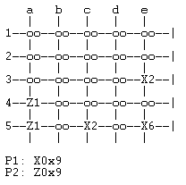
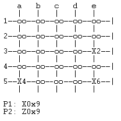

# PLOG 2020/2021 TP1

## Group T1_Nava5
| Name | Number | E-mail |
| ----- | ----- | ----- |
| Antonio Pedro Reis Ribeiro Sousa Dantas | 201703878 | up201703878@fe.up.pt |
| João Miguel Aguiar Cunha | 201403343 | up201403343@fe.up.pt |

---

## Nava
Nava is a 2, 3 or 4 players abstract strategy game. We'll be covering the 2-player version, which is played on a 5x5 grid. At the start of a game each player gets 6 discs and 9 cubes. The 6 discs of each player are positioned on the opposite corners of the board as a stack. The players take turns moving their disc stacks, or part of their disc stacks along the junctions of the board grid in a straight line, not being able to turn corners on the same turn. A stack can move as far as the ammount of discs on it and can be composed of both players discs, being that the owner of the stack is the top piece. As such, a player can split a stack to move the ammount of junctions he wants, noting that the number of junctions moved and the size of the stack being moved must always match. A player can capture enemy stacks, making them their own to control, by moving one of his own stacks to the same junction. When a player moves the entirety of a stack out of a junction he leaves on that same junction one of his cubes. A cube can be removed by making a stack land on the junction the cube is at, being your own or the other player cube.
To win the game a player can either take control of all stacks present at the board or be able to put all his cubes on the board.

[Description](https://www.kickstarter.com/projects/yellowyetigames/nava-the-fast-playing-abstract-game/description?lang=en)
[Rule Book](https://drive.google.com/file/d/1qfZp_uDWRPxPU5U2lN-EGNDfEHkjha1u/view)

---

## Game State Representation

### Board
As representation of the board we used a list of lists. There are five lists within the list and each represent a row of the board. Each cell can have the value of empty, or a list containing the discs on that stack or the single cube. In each cell of these pieces lists there will be a **d** for disc, or a **c** for cube, followed by a **-** and the number **1** for player 1 and **2** for player 2.

### Player
We represent each player by a symbol, **X** for player 1 and **Z** for player 2, followed by the number of discs on that owned stack, with 0 meaning there is a cube. For example: **Z4** for a stack of 4 discs owned by player 2 and **X0** for a cube owned by player 1.

---
### Game States
- Initial State:

```
initial([
    [empty, empty, empty, empty, [d-1, d-1, d-1, d-1, d-1, d-1]],
    [empty, empty, empty, empty, empty],
    [empty, empty, empty, empty, empty],
    [empty, empty, empty, empty, empty],
    [[d-2, d-2, d-2, d-2, d-2, d-2], empty, empty, empty, empty]
]).
```

- Intermediate State:

```
intermediate([
    [empty, empty, [d-1, d-1, d-1], empty, [c-1]],
    [empty, empty, empty, empty, empty],
    [empty, [d-2, d-2, d-2, d-2], empty, empty, [d-1, d-1, d-1]],
    [empty, empty, empty, empty, empty],
    [[d-2, d-2], empty, empty, empty, empty]
]).
```

- Final State:

```
final([
    [empty, empty, [d-1, d-1, d-1, d-2, d-2, d-2], empty, [c-1]],
    [empty, empty, empty, empty, empty],
    [[d-1, d-1, d-2, d-2, d-2], empty, empty, empty, [c-1]],
    [[c-2], empty, empty, empty, empty],
    [[c-2], empty, [d-1], empty, empty]
]).
```
---
### Game State Visualization
#### Menus
When the game is started with the predicate `play/0` it calls the predicate `main_menu/0`.
This predicate uses `print_main_menu/0` to print the menu and reads an input from the user which is used in `manage_input/1`.
If the user types in **1**, `manage_input/1` will start a game of player vs player with the predicate `start_game/2`.
If the user types in **2**, the predicate will print the levels menu with `print_level_menu/0` and start a game of player vs computer with the level chosen by the user on the input.
If the user types in **0** it well end the game and if the user types in any other input, it will send an error message and ask for a new input.

#### Board
The predicate `start_game/2` will use `initial/0` to create the initial game state board and send it to `display_game/3` which will then start to print the board, row by row. 
It does this with the predicates `print_matrix/2`, that prints the rows separators and uses `print_line/1`, which then prints the separators between each element and uses `print_piece/1` to print each piece or empty space.

**Initial State Console View**


**Intermediate State Console View**



**Final State Console View**



---
### Valid Moves
The predicate `valid_moves(+GameState, +Player, -ListOfMoves)` will return a list with all the valid moves a player can do.
To do this it will start by using `find_pieces/5` to find all pieces positions in the board that belong to the player, doing this by iterating through all rows and using `find_row/7` to look through each row and checking each piece with `element/6` to determine which ones belong to the player.
Then the predicate `get_pieces/4` will get all the positions of the pieces into a pieces list which will then be used in the predicate `get_valid_moves/4`.
The predicate `get_valid_moves/4` is going to call `get_valid_piece_moves/3` with each piece, returning a list of all the valid moves for all the pieces of the player. `get_valid_piece_moves/3` will get the coordinates from the piece using `get_coordinates/3` so it can use the predicates `check_up/7`, `check_down/7`, `check_left/7` and `check_right/7`, to check for valid moves in each of the 4 directions, appending all the valid moves for that single piece together.

---
### Making Moves
On `display_game/3` the predicate `get_players_move/3` will read an input from the player corresponding to the move he wants to make. It then checks if the inputed move is present in the list of valid moves. If it exists, it calls the predicate `move(+GameState, +Move, -NewGameState)`, if it doesn't exist, it prints an error message and asks for a new move input.
When the move is valid the predicate `move/3` will then use `get_both_positions/3` and `get_coordinates/3` to find the initial position of the stack to be moved and final position to where the stack is going to be moved. Then the predicate `split_at/4` will split the stack at the initial position, acording to the number of spaces the player chose to move returning the remaining stack that will stay at the initial position and the stack that is going to be moved.
Consequently, `move_piece/7` will move the stack to the final position and add it to the stack in that position in case it exists, updating it. And `update_moved_piece/7` will update the stack in the initial position to the stack gotten from `split_at/4`.
Finally, `make_new_game_state/3` will create a new game state with the updated board after the move.

---
### Game Over
On the end of each round the predicate `game_over(+GameState, -Winner)` will check if there is a winner by using `valid_moves/3` for both players, then getting the smaller between the two with the predicate `get_smaller_list/4` and finally checking if that player lost with `check_winner/3`. This predicate will check if the valid moves list is empty. If it is it will return the other player as the winner, if it isn't it will return the winner as **0**.
Then the winner returned from `game_over/2` is sent to the predicate `end_game/4` which will continue the game normally and call `display_game/3` if the winner value is **0** or end the game, print the winner player number and return to the main menu.

---
### Board Evaluation
The predicate `value(+GameState, +Player, -Value)` is used to determine a numerical value to a player current game state. The higher this value is the closer the player is to winning.
This predicate will call the predicate `inspect_board/4` which will evaluate the board, by counting the number of pieces the player has. It does this by going through each row and using `inspect_row/4` to search in each row for the player pieces with `check_piece/3`. Depending on which piece `check_piece/3` checks it will add 1, -1, or 0 to the row total count. Then each row count is added to the total value in each recursive iteration of `inspect_board/4`. 

---
### Computer Moves
For the computer to make a move, the predicate `choose_move(+GameState, +Level, +ListOfMoves, -NewGameState)` is called in the `display_game/3` predicate.
In the main menu, when the player selects to play against the computer he can choose two levels of difficulty, **0** for easy and **1** for hard. This is used in determining what variation of `choose_move/4`is gonna be used.

#### Easy Mode
This mode randomly chooses a move from the valid moves to play.
In this variation of `choose_move/4` we start by getting the list of valid moves with `valid_moves/3` and the proceeding to randomly select a move from the list.

#### Hard Mode
This mode uses a greedy approach with an evaluating function to determine the best valid move at the time.
In this variation of `choose_move/4` we also start by getting the list of valid moves with `valid_moves/3`, but we use the predicate `get_best_move/5` to find which move from the list will result in a game state with a higher value, by recursively using the `value/3` predicate and comparing each value, keeping the highest as the best possible move.

---

## Conclusions
We started off by having some difficulties because we were still getting used to the prolog language, due to it being so different from the ones we previously studied and because of the increasing complexity behind the game rules in Nava.
After a lot of research and the help we got from classes we managed to mostly overcome these hardships.
In the end, even though we represent the cubes in the game state, we weren't able to fully implement them into the game, even though we knew how to, due to time constraints and the immense work load we had for these weeks. Besides that, we implemented the rest of the game and is fully playable.
We could improve the game by fully implementing the cubes and by improving the `value/3` predicate so the greedy approach would have a better and more complex heuristic.
Finally, we are proud of the game we created and ended up improving our knowledge in prolog by a lot.

---

## Bibliography

- [Split_at/4](https://stackoverflow.com/questions/37341975/prolog-split-list-by-predicate-how-to-check-predicates-result)
- [Succ/2](https://stackoverflow.com/questions/4234001/prolog-definition-of-succ-2)
- [SICSTUS Documentation](https://sicstus.sics.se/sicstus/docs/latest4/html/sicstus.html/)
- Lectures Slides